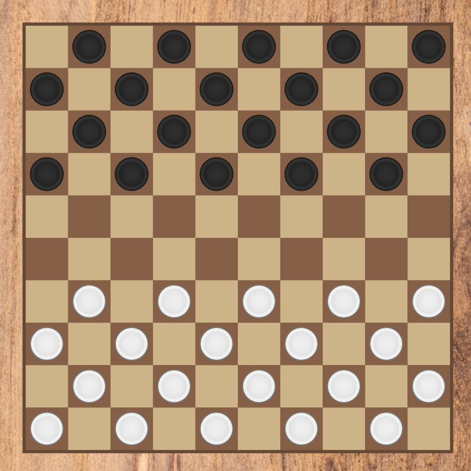

# Checkers

<div align="center">
  
</div>

A checkers application with dozens of regional variants to choose from.

## Overview

This application includes the game of checkers we all know and love. What sets this version apart, however, is the ability to choose from dozens of different regional variations from all across the world with different rule variations to play.

Built with [JavaFX](https://openjfx.io/).

## Features

- **Variant selection**: Choose from many different regional variants. Click on the Info button after clicking on a variant to see its description.
  - **Custom variant**: You can even create your own variant! Adjust various properties such as the number of rows and columns, how pieces move, whether to have flying kings, and many more.
- **UI customization** such as whether to highlight available moves or switch which player is on the top and bottom of the screen.
- **Human and computer player modes**: Choose whether you will play a Human vs. Human, Human vs. Computer, or even Computer vs. Computer game. You may also adjust the difficulty of the computer player.
- **Undo moves**: Made a mistake? No problem! You may undo your last move at any time from the menu.
- **Saving game progress**: If you want to pause the game and continue later, you can safely close the application, and your last game will be resumed where it was.

## Variants

Brief descriptions of a couple popular variants:

- **American checkers**: Played on an 8x8 board, men move and capture diagonally forward only. Pieces are removed during capture.
- **International checkers**: Played on a 10x10 board, men move diagonally forward but capture both forward and backward. Kings are flying and may move freely any number of spaces along unblocked diagonals. Pieces are only removed once all possible captures are made.
- **Turkish dama**: Men move and capture forward and sideways (orthogonally). Kings move and capture forward, sideways, and backward.
- **Frisian dammen**: Movement is diagonal, but captures can be made both diagonally and orthogonally on squares of the same color. This means that if a capture is made orthogonally, the piece can move four squares in that direction.
- **Dameo**: Invented by Christian Freeling in 2000, each player's pieces are arranged forming a trapezoid shape. Men have a special linear movement ability in which they may move along an unbroken line of men of the same color.

## Setup & Usage

### Prerequisites

You must have the following installed on your computer to run the application:

- Java JDK (version 25+)

### Installation

Perform the following steps to be able to run the application:

1. Clone the repository

### Running

In the directory of the repository, run the following command to play checkers:

```
./mvnw javafx:run
```